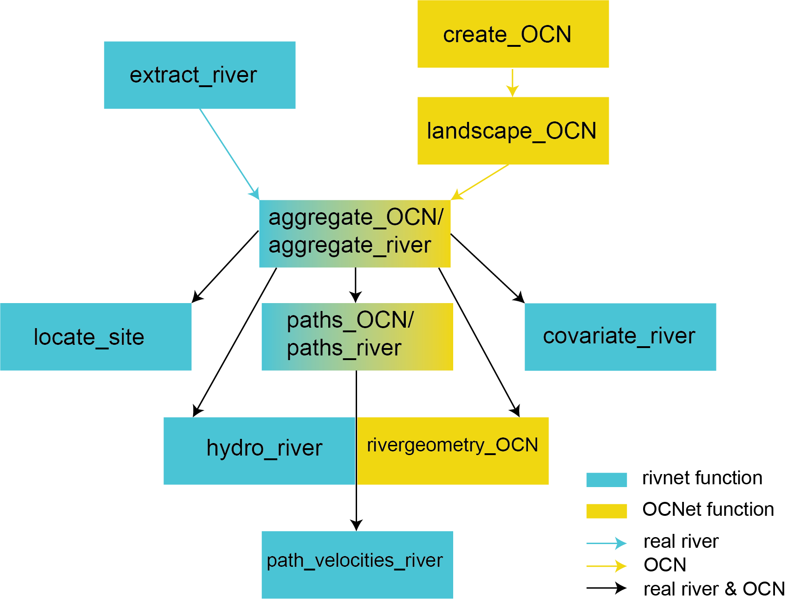

```{r setup, include = FALSE}
knitr::opts_chunk$set(
  collapse = TRUE,
  comment = "#>"
)
``` 

```{r lib, echo = FALSE}
suppressPackageStartupMessages(library(rivnet))
```


# Overview

`rivnet` enables a seamless R-based extraction of river networks and watershed data from Digital Elevation Models (DEMs) without the need to install and operate GIS software. It is primarily intended as a riverscape-analyzing tool for subsequent ecological, hydrological and biogeochemical modelling.

Features:

* Analyze user-provided DEMs or automatically downloaded from open source repositories
* Identify flow directions by implementing TauDEM's D8 flow direction algorithm
* Delineate reaches, subcatchments, lengths, slopes and areas
* Calculate along-stream distances between network nodes
* Attribute sites to a river network
* Evaluate covariates at subcatchment level from user-provided raster files
* Derive hydraulic and hydrological variables across a network from point measurements

rivnet produces `river` objects, which are compatible with the `OCNet` package, and can hence be analyzed and displayed with `OCNet` functions. As such, `river` objects can be made compatible with the `igraph` and `SSN` packages.

# Installing the package

`rivnet` can be installed from Github:

```{r, eval=FALSE}
devtools::install_github("lucarraro/rivnet")
```

Among other packages, `rivnet` depends on the `traudem` package, and in turn, on the [TauDEM](https://hydrology.usu.edu/taudem/taudem5/) library. `traudem` provides a guide to correct installation of TauDEM and its dependencies for different operating systems, and offers wrapper commands to call TauDEM methods from R. Please read the `traudem` [documentation](https://lucarraro.github.io/traudem) carefully.

# Workflow

Functions and output from packages `rivnet` and `OCNet` are interoperable according to the following workflow:

```{r overview, echo=FALSE, fig.cap="Overview of `rivnet` and `OCNet` functions. `aggregate_river` is an alias for `aggregate_OCN`, and `paths_river` is an alias for `paths_OCN`; `path_velocities_river` requires `paths_river` and one between `hydro_river` and `rivergeometry_OCN`.", out.width = '80%'}

```

The main function of `rivnet` is `extract_river`. This function analyzes a DEM and generates a `river` object. Necessary inputs are either an user-provided DEM or the extent of a region where DEM data should be downloaded from open-source repositories (via the `elevatr` package); and the coordinates of the outlet(s) of interest. `extract_river` can also be used as a wrapper for the TauDEM set of functions extracting D8 flow directions and contributing area:

```{r taudem, echo=FALSE, fig.cap="Workflow of TauDEM functions used by `extract_river`. Refer to the TauDEM documentation for details on these functions.", out.width = '80%'}
knitr::include_graphics("TauDEM_workflow.png")
```

`river` objects obtained from `extract_river` can then be processed by `aggregate_river` (which builds a river network at different aggregation levels) and `paths_river` (which calculates paths and path distances between network nodes). Refer to the `OCNet` [documentation](https://lucarraro.github.io/OCNet/articles/OCNet.html) for details on the definition of aggregation levels and the behavior of these functions.

# A minimal example

Extract a river (Wigger, Switzerland) from an user-provided DEM:
```{r}
fp <- system.file("extdata/wigger.tif", package = "rivnet")
r <- extract_river(outlet = c(637478, 237413), DEM = fp)
r
```
Outlet coordinates must be expressed in the same coordinate system as the input DEM.

The same river can be extracted starting from DEM data downloaded from open-source servers:
```{r, fig.width=7, fig.height=7}
r2 <- extract_river(outlet = c(637478, 237413),
	EPSG = 21781, #CH1903/LV03 coordinate system
	ext = c(6.2e5, 6.6e5, 2e5, 2.5e5),
	z = 8)


plot(r2)

```

A `plot` method has been defined for `river` objects, which calls different drawing functions from the `OCNet` package. Its default behavior depends on the attributes included in the `river` object:
```{r, fig.width=7, fig.height=7}
r2 <- aggregate_river(r2)
plot(r2)

```

For computational speed issues, the examples provided are derived from rather coarse DEMs. To increase the resolution of the DEM (and thus of the resulting `river`), it is possible to increase the `z` value in `extract_river` (see `elevatr` documentation for details).

# Other functions

* `locate_site`: finds the river network node that is closest to a given site (identified by its coordinates). Attribution can be performed either as the crow flies, or following the steepest descent. It is possible to use the `locator()` function to identify the input coordinates by directly clicking on a river plot.
* `covariate_river`: attributes covariate values from user-defined raster files to subcatchments of a river network. Both local and upstream-averaged covariate values are calculated. Covariates can be either categorical (e.g., land cover classes) or continuous (e.g., temperature values).
* `hydro_model`: assigns hydraulic variables (width, river depth, water discharge, and derived variables) to all nodes of a network starting from a minimal number of measured values, and based on power-law scaling relationships and uniform flow equations (Gauchler-Strickler-Manning). It can deal with non-rectangular cross-sections (and hence varying width as a function of discharge).

